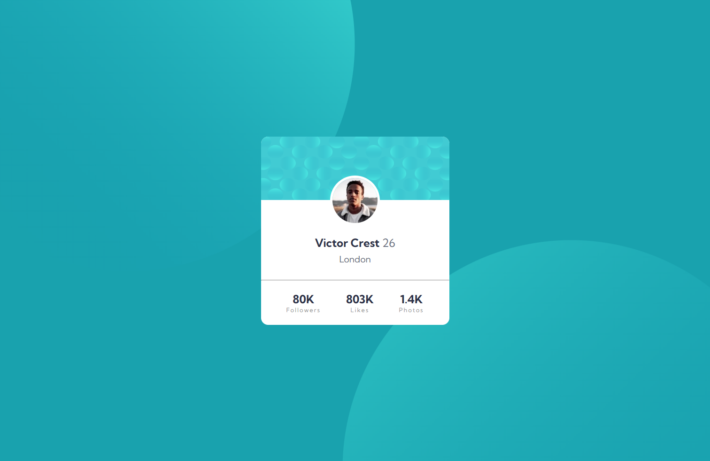
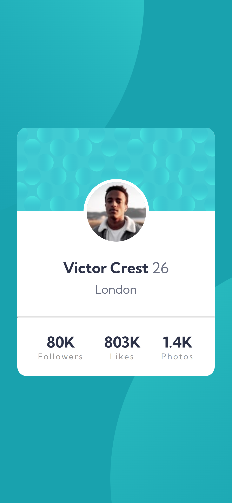

# Frontend Mentor - Profile card component solution

This is a solution to the [Profile card component challenge on Frontend Mentor](https://www.frontendmentor.io/challenges/profile-card-component-cfArpWshJ). Frontend Mentor challenges help you improve your coding skills by building realistic projects. 

## Table of contents

- [Overview](#overview)
  - [The challenge](#the-challenge)
  - [Screenshot](#screenshot)
  - [Links](#links)
- [My process](#my-process)
  - [Built with](#built-with)
  - [What I learned](#what-i-learned)
- [Author](#author)
- [Acknowledgments](#acknowledgments)

## Overview

### The challenge

- Build out the project to the designs provided

### Screenshot

### Links

- Solution URL: [https://github.com/Tjay05/ProfileCard](https://github.com/Tjay05/ProfileCard)
- Live Site URL: [https://tjay05.github.io/ProfileCard/](hhttps://tjay05.github.io/ProfileCard/)

## My process

### Built with

- Semantic HTML5 markup
- CSS custom properties
- Flexbox
- Mobile-first workflow

### What I learned

Learnt how to display two or more background images, how to size it and position them as well

## Author

- Frontend Mentor - [@Tjay05](https://www.frontendmentor.io/profile/Tjay05)
- Twitter - [@tjay_yy](https://www.twitter.com/tjay_yy)

## Acknowledgments

All glory belongs to God!
